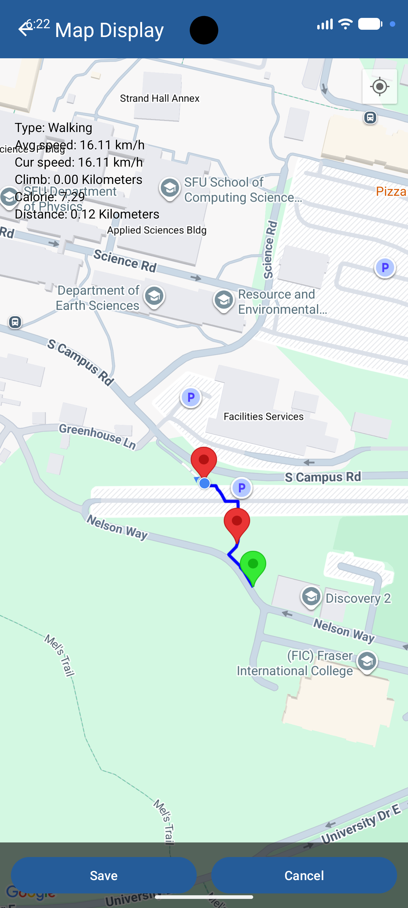
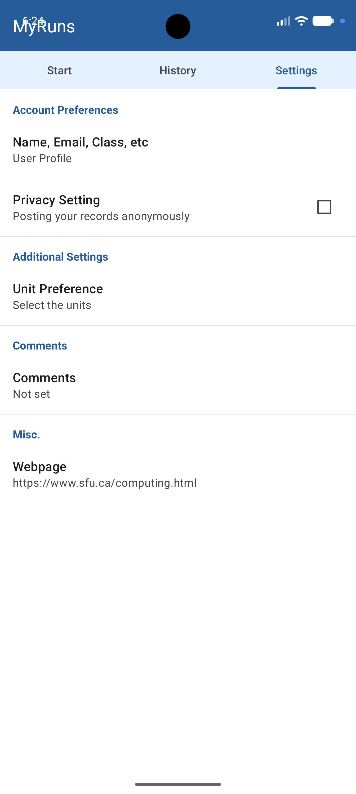
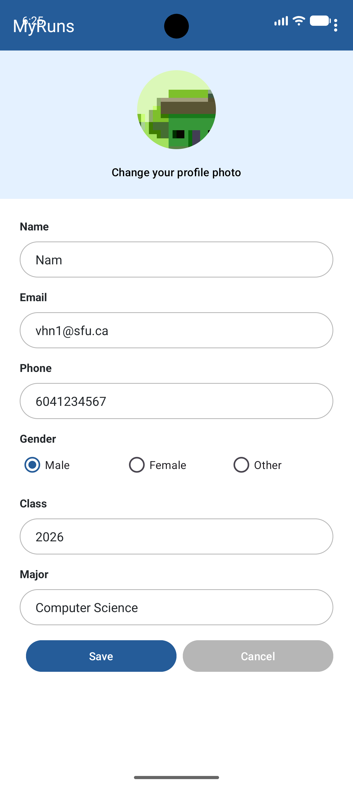

# MyRuns

Android app for tracking workouts. Log stuff manually, track runs with GPS, or let the phone figure out what you're doing on its own using the accelerometer.

## Features

**Activity tracking**
- Manual entry for things like swimming, cycling, or yoga — duration, distance, calories
- GPS tracking for runs, walks, and hikes, with a live map (Google Maps SDK)
- Automatic activity recognition containing accelerometer data + a Weka classifier decide if you're standing, walking, or running

**History**
- List of past activities with distance, duration, pace
- Tap into any activity to see the route on a map or read your notes
- Switches between metric and imperial depending on your settings

**Profile**
- Name, email, phone, profile picture (camera or gallery)
- Unit preferences and privacy toggles

## Architecture

MVVM throughout.

- Kotlin
- XML layouts, Material 3
- ViewPager2 + TabLayout for the main navigation
- Room for local storage
- Coroutines/Flow for async DB calls and location updates
- Foreground service for tracking while backgrounded (Android 14+ compliant)
- Custom FFT + Weka classifier for the sensor-based recognition
- Google Maps Platform for the map view

## Screenshots

| Start | Settings | Profile |
| :---: | :---: | :---: |
|  |  |  |

## Setup

1. Clone the repo:
   ```bash
   git clone https://github.com/yourusername/MyRuns.git
   ```
2. Add your Maps API key — create `local.properties` in the root and add:
   ```properties
   MAPS_API_KEY=YOUR_API_KEY_HERE
   ```
3. Open in Android Studio, sync Gradle, run on an emulator or device.

Needs Android Studio Ladybug or newer, SDK 35.

## Author

Nam Nguyen
